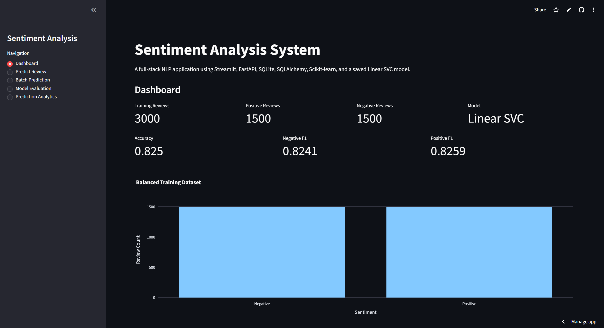
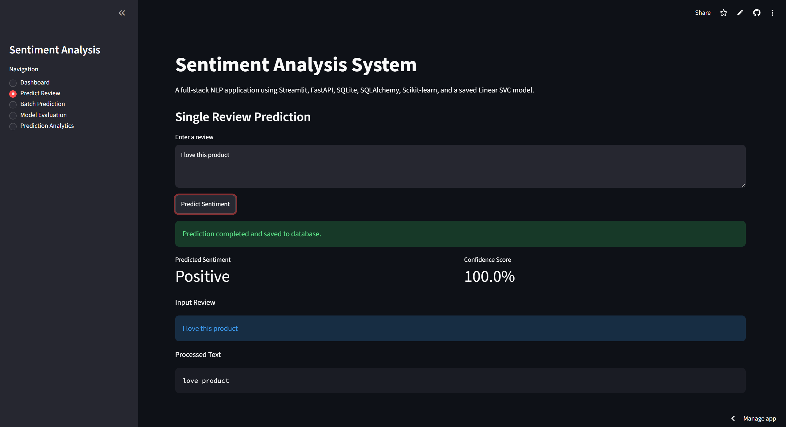
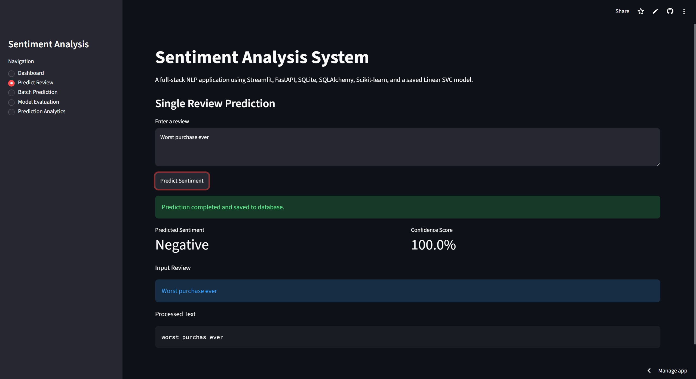
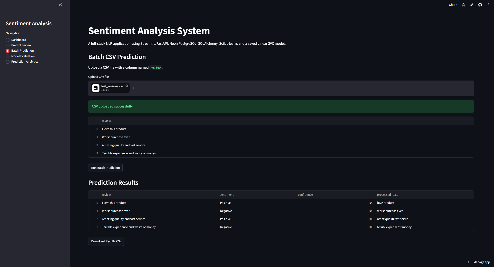
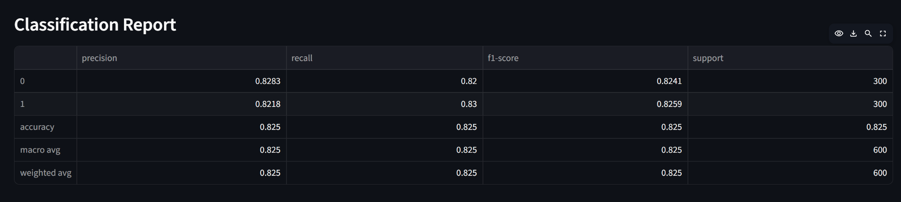
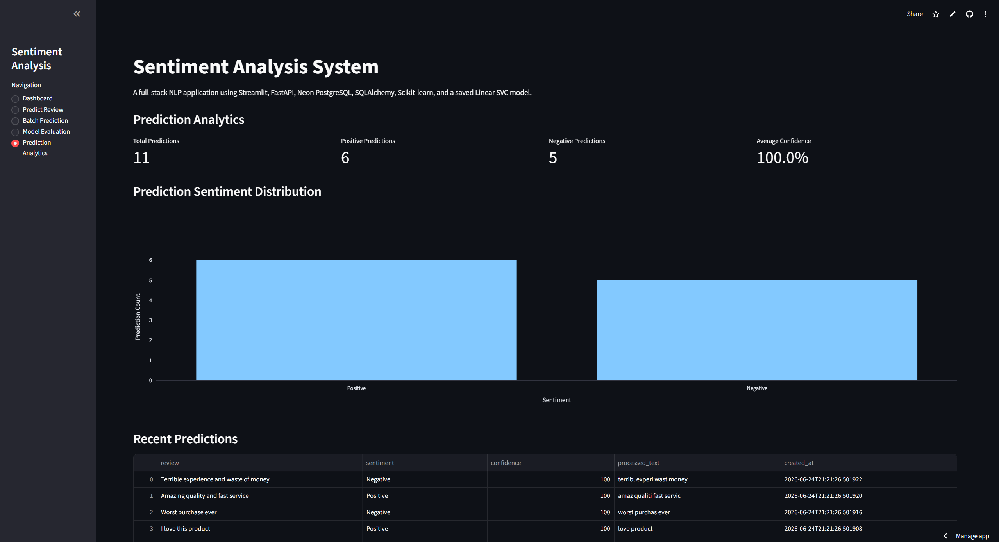

# Sentiment Analysis System

A full-stack Natural Language Processing (NLP) application that classifies customer reviews as **Positive** or **Negative** using Machine Learning and provides real-time predictions through a modern web interface and REST API.

---

## Live Demo

### Frontend (Streamlit)

https://sentiment-analysis-app-wlhpdgtxsrujcuepwjimzk.streamlit.app

### Backend API (FastAPI)

https://sentiment-analysis-api-r6av.onrender.com/docs

---

## Project Overview

This project was developed to demonstrate a complete Machine Learning application lifecycle including:

* Data Collection and Preprocessing
* NLP Feature Engineering
* Machine Learning Model Training
* Model Serialization
* REST API Development
* Database Integration
* Cloud Deployment
* Interactive Analytics Dashboard

The system allows users to:

* Predict sentiment for individual reviews
* Perform batch sentiment prediction using CSV files
* Track prediction history
* Analyze model performance
* Monitor prediction analytics

---

## Features

### Dashboard

* Dataset overview
* Model performance metrics
* Training data statistics
* Sentiment distribution visualization

### Single Review Prediction

* Real-time sentiment prediction
* Confidence score generation
* Text preprocessing visualization
* Prediction history storage

### Batch CSV Prediction

* Upload CSV files
* Bulk sentiment prediction
* Download prediction results
* Automated processing through FastAPI

### Model Evaluation

* Model comparison
* Confusion matrix visualization
* Classification report
* Production model performance metrics

### Prediction Analytics

* Total predictions count
* Positive vs Negative prediction tracking
* Average confidence score
* Historical prediction records
* Sentiment distribution charts

---

## Machine Learning Pipeline

### Dataset

The model is trained on a balanced dataset created from:

* Amazon Product Reviews
* IMDb Movie Reviews
* Yelp Reviews

Total Records:

* Positive Reviews: 1500
* Negative Reviews: 1500
* Total Reviews: 3000

### NLP Preprocessing

The following NLP techniques are applied:

* Lowercasing
* Punctuation Removal
* Stopword Removal
* Tokenization
* Porter Stemming

Example:

Input:

I absolutely love this product!

Processed:

absolut love product

### Feature Engineering

Count Vectorization is used to convert text into numerical features.

### Production Model

Linear Support Vector Classifier (Linear SVC)

Performance:

* Accuracy: ~82.5%
* Precision: ~82%
* Recall: ~83%
* F1 Score: ~82.5%

---

## Technology Stack

### Frontend

* Streamlit

### Backend

* FastAPI
* Uvicorn

### Machine Learning

* Scikit-learn
* NLTK
* Joblib

### Database

* Neon PostgreSQL
* SQLAlchemy ORM

### Data Processing

* Pandas
* NumPy

### Visualization

* Plotly
* Matplotlib

### Deployment

* Streamlit Community Cloud
* Render
* Neon Database

---

## System Architecture

User

↓

Streamlit Frontend

↓

FastAPI Backend

↓

Linear SVC Model

↓

Neon PostgreSQL Database

↓

Prediction Results & Analytics

---

## API Endpoints

### Health Check

GET

/health

Returns API status information.

### Predict Sentiment

POST

/predict

Input:

{
"review": "I love this product"
}

Output:

{
"sentiment": "Positive",
"confidence": 100.0,
"processed_text": "love product"
}

### Batch Prediction

POST

/predict-batch

Predicts sentiments for multiple reviews.

### Prediction History

GET

/history

Returns stored prediction records.

### Analytics

GET

/analytics

Returns prediction statistics and analytics.

---

## Application Screenshots

### Dashboard



---

### Positive Prediction



---

### Negative Prediction



---

### Batch Prediction



---

### Model Evaluation



---

### Prediction Analytics



---

## Project Structure

```text
Sentiment-Analysis-System/

│
├── app.py
├── backend.py
├── create_dataset.py
├── requirements.txt
├── runtime.txt
├── Procfile
├── README.md
│
├── backend_api/
│   ├── __init__.py
│   ├── main.py
│   ├── database.py
│   ├── models.py
│   └── schemas.py
│
├── data/
│   ├── amazon_cells_labelled.txt
│   ├── imdb_labelled.txt
│   ├── yelp_labelled.txt
│   └── sentiment_dataset.csv
│
├── saved_models/
│   ├── linear_svc_model.joblib
│   └── count_vectorizer.joblib
│
└── screenshots/
```

---

## Local Setup

Clone the repository:

```bash
git clone <repository-url>
cd Sentiment-Analysis-System
```

Create virtual environment:

```bash
python -m venv venv
```

Activate environment:

Windows:

```bash
venv\Scripts\activate
```

Install dependencies:

```bash
pip install -r requirements.txt
```

Run FastAPI backend:

```bash
uvicorn backend_api.main:app --reload
```

Run Streamlit frontend:

```bash
streamlit run app.py
```

---

## Future Improvements

* BERT-based sentiment classification
* Multi-class sentiment analysis (Positive, Negative, Neutral)
* User authentication system
* Advanced analytics dashboard
* Docker containerization
* CI/CD pipeline
* Model retraining automation
* Larger production datasets

---

## Learning Outcomes

This project demonstrates practical experience with:

* Machine Learning
* Natural Language Processing
* Model Deployment
* FastAPI Development
* Database Integration
* SQLAlchemy ORM
* Cloud Deployment
* Full-Stack Python Development

---

## Author

Aditya Ingale 

Built as a portfolio project to demonstrate end-to-end Machine Learning application development using Python.
